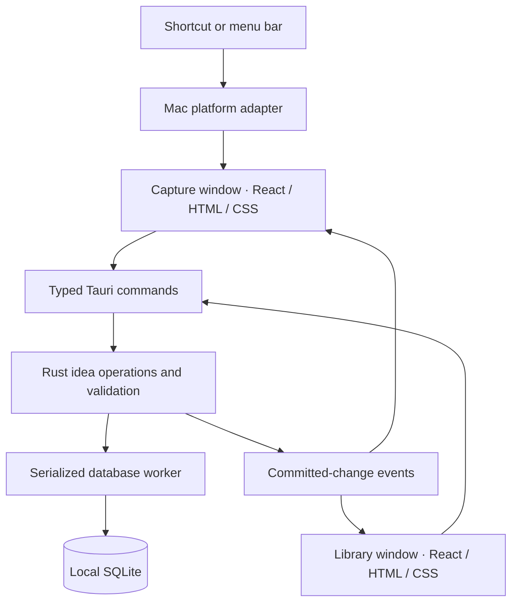
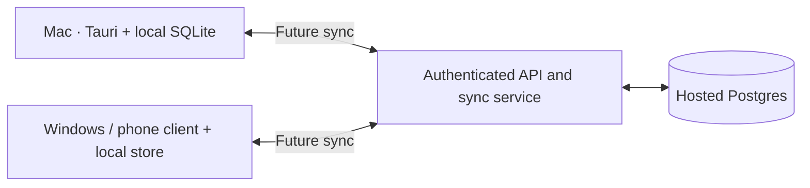

# Pocket — comprehensive Tauri MVP plan

Version 1.6 · September 20, 2026 · Local Mac implementation is now available. This document remains the product specification; see README.md for running the app and docs/VERIFICATION.md for observed results and remaining manual checks.

**Pocket revision, September 20:** The app is named Pocket and uses the Pocket note icon: a cream notebook slip tucked into a stitched sage pocket on warm clay. The main library heading reads Pocket; List and Grid use newest-first ordering without a visible sort selector. Capture uses ruled paper with a softly torn edge and no center crease. After commit, it folds into the pocket over 1.9 seconds before the existing check hold and native fade. These choices supersede the earlier glass/circle treatments. The bundle identifier and local database location remain stable.

**Completion revision, September 20:** The completed checkmark holds for one second, then the whole native capture window fades out over 280 ms. The bar resets only after the window is hidden at zero opacity, preventing a closing flash. A new capture/library request skips the remaining hold. These timings supersede the earlier completion-duration targets below.

**Interaction and visual revision, September 20:** The latest direction adds warm ivory glass, terracotta actions, sage link confirmations, and serif titles. Placeholder prompts change at each invocation without an immediate repeat; permanent slogans remain removed. Submission animates the native glass and web surface together into a circle, spins while saving, and draws a check only after commit. Settings record pressed shortcut combinations as keycaps. Two distinct shortcut presses within 450 ms open the library; keyboard autorepeat is ignored. A full URL pasted into capture becomes a reference; repeating it within three seconds without intervening editing inserts it as text while retaining the reference. Mixed prose stays text, and the explicit link button remains. Sidebar ideas use one line with explicit title (or Untitled), type dot, optional star, and relative creation age. These decisions supersede conflicting earlier presentation details below.

**Visual revision, September 19:** The user's subsequent Spotlight reference supersedes the decorative presentation below. Capture is now a single compact, translucent field with link, library, and save icons. It expands and shrinks with content; attached-link dots appear only when links exist. Native macOS vibrancy provides the glass surface. Rotating phrases, permanent shortcut instructions, slogans, ornamental empty states, and the separate discard control are removed. The library uses a quiet translucent sidebar and plain editor; autosave feedback fades after acknowledgment, and Command–S remains available without a redundant Save button. The data and persistence contracts are unchanged.

**Product promise:** Capture a thought immediately, receive a trustworthy saved confirmation, and return later to develop it.

This document replaces the earlier exploratory plan. Tauri is the selected framework. The user supplied capture and idea-expansion mockups, agreed with inspectable controls and the preceding capture recommendations, and requested a small shake for invalid link pastes. Sidebar colors represent idea type. Expanded writing renders formatting as the user types and offers a small toolbar. Detailed visual timing and library refinements below remain implementation proposals.

**1. Decisions and boundaries.** Build a personal Mac application first, with a path to Windows, phone access, and hosted sync.

| Decision | Plan | Status |
| --- | --- | --- |
| App framework | Tauri 2, using web technologies for the interface | User selected |
| Product priority | Reliable, low-friction functionality with a clear, pleasant interface | User selected |
| Initial platform | The user's Mac; local use without an account | User selected |
| Capture | Small window invoked by a shortcut; multiline unstructured input | User selected |
| Save feedback | Visible confirmation and a short closing animation | User selected |
| Library | Browse ideas, expand them, tag, star, and archive | User selected |
| Interface implementation | React, TypeScript, Vite, and CSS | Engineering default |
| Local storage | SQLite, owned by the Rust application layer | Planning recommendation carried forward |
| Future shared storage | Hosted Postgres behind an authenticated API and sync layer | Future architecture |
| Native integration | Use Tauri APIs first; add targeted AppKit integration for Mac behavior where necessary | Engineering default |
| Shortcut | Configurable conventional shortcut, plus double Command if it passes the interaction tests | Engineering default; gesture to validate |
| Appearance | Functional custom styling; native Apple visual replication is not an acceptance requirement | Follows user's functionality priority |
| Capture layout | Compact rounded panel; friendly phrase; growing editor; link circles at lower left; book/library and save actions at lower right | User's mockup |
| Link references | Add relevant URLs through the footer; keep URL text out of the resting popup and show circles as confirmation | User requested |
| Library layout | Left idea list; right title/tags/actions, large writing area, resources, and Save | User's expansion mockup |
| Sidebar colors | Consistent colors for idea Type tags | User confirmed |
| Invalid link paste | Small shake localized to the link section, with understandable feedback | User requested |
| Expanded writing | Formatting renders as the user types, with a small toolbar | User confirmed |
| Body editor implementation | Tiptap with a limited formatting schema; versioned JSON stored locally | Engineering default |

An idea is the central object. A weekend project, poem, essay, video concept, or question are all ideas. “Project” is a Type tag, with no separate project-management hierarchy.

The MVP includes capture, separate URL references, draft recovery, local persistence, library editing with lightweight formatting, two tag axes, search/filter/sort, starring, archive/restore, shortcut settings, optional launch at login, and data export. Hosted services, accounts, Windows delivery, phone apps, semantic search, clustering, graphs, file attachments, audio recording, advanced document layout/embeds, collaboration, reminders, and automatic tagging belong to later releases.

**2. Success criteria.** The application succeeds when the user can interrupt their work briefly, save a thought confidently, and resume without checking whether the save worked.

The normal capture path requires one invocation and one commit action, with typing in between. Naming, classifying, and opening the library are optional. Capture and browsing must work with the network disconnected.

The following are initial engineering targets, measured in a release build on the user's Mac. They are targets to test, not results already achieved:

| Measure | Initial target and method |
| --- | --- |
| Warm invocation to editor accepting input | p95 at or below 200 ms across 50 invocations; app is already running |
| Lost first keystrokes | Zero in the same capture test |
| Commit request to local save acknowledgment | p95 at or below 100 ms for an ordinary text capture |
| Commit request to returning focus | Normally within 450 ms, including the short success animation |
| Library search response | p95 at or below 150 ms after the debounce, using 5,000 representative ideas |
| Saved-state correctness | Every displayed success corresponds to a completed database transaction |
| Accidental gesture activation | Zero in the scripted Command-shortcut test; revisit after daily use |
| Recovery | Persisted drafts and committed ideas survive normal quit, relaunch, and tested failure cases |

Use several ordinary applications, a full-screen application, and the user's monitor arrangement. Track cold launch separately: a shortcut is available only while the app is running. The app should remain available in the menu bar after the library closes.

**3. Capture behavior.** The capture panel accepts the thought exactly as written, including line breaks, indentation, Unicode, emoji, and pasted text.

| Action or situation | Required result |
| --- | --- |
| Invoke capture while hidden | Show one panel on the current Space; focus the text field immediately |
| Invoke capture while already visible | Focus that panel and preserve its text |
| Existing unfinished draft | Restore it when the panel is shown |
| Return | Insert a newline |
| Command–Return or Save | Commit one idea |
| Input method composition | Composition keystrokes must not accidentally submit the idea |
| No nonwhitespace text and no attached links | Create no idea; leave the panel ready for input |
| Focus the link area, then paste a URL | Add it to the draft and show a filled circle after its draft write succeeds |
| Select an existing link circle | Inspect, open, copy, or remove that reference through a compact popover |
| Click the book | Persist the draft, then open the library; do not automatically create an idea |
| Escape, close button, or click away | Preserve the draft, then dismiss |
| Explicit Discard | Clear the unfinished draft without creating an idea |
| Successful save | Show Saved, play the completion motion, dismiss, and restore focus appropriately |
| Failed save | Preserve the text, show an understandable error and Retry, and omit success feedback |
| Repeated Save while a commit is in flight | Produce one idea |
| New invocation during completion motion | Finish or skip the cosmetic transition and accept the next capture promptly |

Ordinary dismissal is not discard. There is initially one capture draft, shared by the shortcut, menu bar action, and New Idea action in the library. Text and attached URLs both make a draft nonempty. Such a draft must be explicitly discarded before it is replaced with a fresh one. Allow link-only captures, with a hostname preview until a title or thought is added.

Start text draft autosave with a 300 ms debounce. Link additions/removals request an immediate write of the latest complete text-and-links snapshot. Flush that snapshot before ordinary dismissal, library navigation, or normal quit. A failed flush keeps the draft recoverable in memory and leaves the panel available with an error; it must not silently dismiss and claim persistence. Clicking away must not cause the app to steal focus back while it handles that failure.

The first-run experience explains the shortcut and lets the user test one capture. Subsequent background/login launches remain quiet. The capture footer contains link references, library access, and Save; tags and type selection initially live in the library.

**4. Save lifecycle and interruption handling.** The Rust core owns the commit boundary, and the frontend owns the visual response to the result.

The logical states are Hidden, Editing, Saving, Saved, and Save Error. Dismissing an unfinished capture passes through a draft-write operation before hiding. A success animation is never evidence that a save has started; it follows a successful commit.

A capture receives a stable UUID when its session is created. That UUID becomes the idea's ID when committed. Each reference also receives a stable UUID when attached. Saving performs one transaction that inserts the idea and its ordered link records and removes its corresponding draft. Retrying an acknowledged-or-uncertain request with the same ID must return the existing identical text-and-links capture rather than inserting another idea or duplicate references. If the existing content unexpectedly differs, preserve the incoming buffer and return a conflict instead of overwriting.

Autosave requests carry the capture ID, an increasing draft sequence, and the complete text-and-links snapshot. The core accepts writes only for its active capture session, rejects an older sequence, and refuses to recreate a draft for an already committed capture. Discard retires the session before removing its persisted draft; delayed requests from that session are rejected too. This prevents a late autosave from resurrecting saved/discarded text or a removed link.

While committing, freeze that submission's text-and-links snapshot and make the editor and attachment controls briefly read-only. Additional Save requests refer to that same snapshot. After success, the next capture receives a new ID. Do not clear the editor or circles before the successful response.

Start with roughly 250–350 ms for the completion animation, with a visible Saved label and a screen-reader announcement. Respect Reduce Motion. A repeat capture should not have to wait for decorative motion.

Record the return target when showing the hidden panel: either the prior external app or the library window. Restore it on save/Escape only if the capture still owns focus. If the user has clicked into another application, respect that choice. A terminated prior app must not cause an error or be relaunched. Book-button navigation deliberately hands focus to the library, without first activating the prior external app. Escape closes a link popover/paste mode before a subsequent Escape dismisses the capture panel.

A sudden process crash can lose text typed since the last completed draft/autosave write. State this limit accurately in development notes; validate committed saves separately from uncommitted typing.

**5. Shortcut and Mac integration.** Keep the platform-specific implementation behind a small interface.

Use Tauri's [global-shortcut plugin](https://v2.tauri.app/plugin/global-shortcut/) for conventional combinations. Initial candidate: Command–Shift–Space, subject to availability. Settings must report registration failure and let the user choose another binding. Retain a working binding until a replacement is registered successfully where the API permits, and never silently substitute another shortcut.

Double Command is a preferred gesture to evaluate in the first milestone. It requires custom modifier-event handling, rather than treating it as a normal registered key combination:

- Recognize two complete taps of the same Command key; either left or right may be used.
- Start with a maximum 300 ms gap between the first release and second press, then tune through use.
- Cancel the candidate if another key or modifier participates, the key is held too long, the timing expires, or the app/session changes state.
- Ignore key repeat; simultaneous or mixed-side Command presses do not match initially.
- Confirm the second release before opening capture, so Command is not held when typing starts.
- Observe both application-local and external events as needed, without swallowing ordinary shortcuts.
- Process only the event information needed for the gesture; do not record typed content.

Apple documents Accessibility requirements for key-related [global event monitoring](https://developer.apple.com/documentation/appkit/nsevent/addglobalmonitorforevents%28matching%3Ahandler%3A%29?changes=_8). Verify the selected mechanism on the actual Mac. Explain the relevant permission when the user enables the gesture. If permission is denied or revoked, keep conventional shortcut and menu bar access available without repeatedly prompting.

Expose operations such as showCapture, dismissCapture, registerShortcut, and restoreFocus through a platform adapter. Use Tauri's native APIs first. Add AppKit code in the Mac adapter where testing demonstrates a need; Tauri exposes its [native Mac window handle](https://docs.rs/tauri/latest/src/tauri/webview/webview_window.rs.html#1833-1837).

Initial placement is centered horizontally in the upper portion of the display containing the pointer, bounded within its usable area. Appearance on the current Space, behavior over full-screen apps, Stage Manager, and focus restoration are explicit tests. Fine positioning and dimensions can follow the mockup.

**6. Library behavior.** One library window provides discovery, development, and organization.


| Capability | MVP rule |
| --- | --- |
| Views | Active, Starred, Archive |
| Active | All nonarchived ideas |
| Starred | Starred, nonarchived ideas |
| Archive | Archived ideas, retaining their star and tags |
| Ordering | Newest captured by default; also oldest captured and most recently edited |
| Opening an idea | Show optional title, separate captured thought, expanded details, tags, resources, and state controls |
| Title | Optional; preview uses the first nonempty capture line when absent, or the first attached hostname for a link-only capture |
| Expansion | Main writing area renders formatting as the user types; small toolbar for headings, emphasis, lists, quotes, and links; preserve intentional line breaks |
| References | Separate list of attached URLs; inspect/open/copy/add/remove; preserve capture order |
| Editing | Autosave with Saving, Saved, and error states; Save is an explicit flush of current edits |
| Starring | Independent on/off state |
| Archiving | Preserve data, remove from active views, offer a brief Undo action |
| Restoring | Return to active views with prior star and tags intact |
| Deletion | Permanent deletion and trash are deferred; archive handles removal from active browsing |
| New Idea | Invoke the same capture panel and its current draft |
| Closing the library | Flush edits and close the window; keep the app resident |
| Quit | Flush all pending writes; explain a write failure instead of silently losing unsaved text |

Use a 500 ms initial debounce for content edits. Serialize writes for the selected idea and flush before navigation, archive, or normal window close. Failed writes preserve the editable buffer and expose Retry. The core returns a revision with mutations; stale content edits must be rejected with the user's text retained.

Keep the mockup's Save button as a reassuring “save now” action. Save, Command–S, and Command–Return flush the current idea's pending changes and wait for their acknowledgment; they do not close the library or create a new idea. Editing can continue during an autosave, but Saved is shown only after the newest local edit has persisted, not when an older request finishes. A library save can have a small check/status transition without the capture popup's closing animation.

The sidebar should expose search and Active/Starred/Archive views above a scrollable idea list. Rows show a title or capture preview, a clear selected state, and Type colors. Keep date/snippet information restrained. Support multiple Type tags with up to two small color markers and a +N overflow, rather than requiring a primary type. Untyped ideas use a neutral marker. Type names remain available as labels/tooltips and accessible descriptions; color alone does not carry the meaning.

The right pane follows the sketch: editable title, Type and Topic chips, star/archive actions, the writing area, and Resources beneath it. Keep the captured fragment available as a small expandable “Captured thought” section near the editor, preserving its original whitespace and allowing corrections. It is separate from the title and expanded body, and omitted for link-only captures. Avoid making the title or archive action compete with the main writing area.

Use independent sidebar and detail-pane scrolling. Give long writing a comfortable line length, keep save status easy to find, and preserve the selection/scroll position during autosave. Resources contains the same URL records attached during capture, displayed as readable hostname/URL items with Open, Copy, Add, and Remove. An empty resources section can stay compact. Freeform inspiration or quotes belong in the body for this version; image/file attachments remain deferred.

**Writing experience:** The user selected formatting that renders while typing, with a small toolbar. Use Tiptap as the engineering default, with a limited set of its [standard editing extensions](https://tiptap.dev/docs/editor/extensions/functionality/starterkit). The toolbar offers paragraph/heading, bold, italic, bulleted/numbered lists, quote, and link controls. Support familiar editing shortcuts and undo/redo, keep controls inspectable and keyboard accessible, and preserve the text selection when applying formatting. Keep the toolbar small and accessible while writing; exact positioning can be refined in the prototype. The capture popup remains a plain multiline editor.

Store the expanded body as Tiptap document JSON with an application-owned body schema version, and derive readable text for search. The supported schema contains document, paragraph, heading, text, hard break, bullet/ordered list, list item, and blockquote nodes, plus bold, italic, and link marks. Configure only the required extensions. Validate the supported structure and link schemes in the core before persisting. An untouched body is a valid empty document. Supported formatting survives save/reload and export; an unsupported future schema must surface a recovery path rather than being silently rewritten. The body JSON is the single editable source of truth.

Update only the fields named in each operation. A star update must not overwrite the body, and a delayed body save must not overwrite links, tags, or archive state. Adding/removing a reference updates the idea's content timestamp and revision. Cross-window notifications invalidate cached records; they must not replace a dirty editor buffer with an older snapshot. Opening the library from the book retains the capture draft, which can be resumed through New Idea/capture; it is not an entry in Active until explicitly saved.

Preserve intentional line breaks in the body editor, including poetry. Use Return for a paragraph/list item and Shift–Return for a line break, following the editor's current context. Validate save/reload and paste behavior for indentation, repeated spaces, blank lines, and emoji; configure whitespace handling so verse layout is retained. Keep raw capture text exact. Support only the selected formatting schema, without executing pasted content or allowing arbitrary embedded HTML. Opening a URL is a deliberate user action through an approved external opener.

Support keyboard access to the list, editor, state controls, and tag controls. Command–N opens capture, Command–F focuses search, and Command–W closes the library after saving. Editor Command–S and Command–Return flush edits; neither creates a second idea.

**7. Tags, search, and collection rules.** Organization happens at the user's pace.

Two axes are sufficient initially:

| Axis | Meaning | Suggested initial choices |
| --- | --- | --- |
| Type | What the idea could become | Project, Poem, Essay, Video, Exploration |
| Topic | What it concerns | User-created; no mandatory initial taxonomy |

Both axes allow zero or many tags. Suggested Type values are editable suggestions, never restrictions. Support creating and renaming tags, adding/removing assignments, and autocomplete. Names are trimmed and normalized consistently to avoid case-only duplicates within an axis. Renaming changes the label everywhere; a collision asks the user to choose the existing label rather than silently merging records. Hierarchies and tag merging are deferred.

Assign each Type a stable color key from a small palette and use it consistently in sidebar markers and Type chips. Preserve it when the Type is renamed, exported, or eventually synced. Multiple types produce multiple cues; Topic tags remain visually quieter. Color is descriptive and must not introduce an unrequested progress or staleness state.

Selected tags use OR within an axis and AND across axes. For example, (Poem OR Essay) AND Memory. Type/Topic filters combine with search, view, and an optional captured-date range. “No tags” means no assignments in either axis. Calendar date filters use the user's local day boundaries.

Start with literal, case-insensitive substring search across title, capture text, the body editor's readable text, and attached URLs/hostnames. Partial words and punctuation work without a query language. Normalize a derived search field and query in Rust using consistent Unicode normalization and case handling; preserve original content separately. Extract readable text from the selected canonical body format without exposing JSON keys or formatting syntax as search content. Update the derived field in the same transaction as body/text or reference edits.

Use a 150 ms input debounce and reject stale search responses. Keep the selected date sort when searching, with idea ID as a deterministic tie-breaker for pagination. Filter Archive explicitly rather than surfacing archived results unexpectedly.

Measure this simple search using 5,000 representative ideas. Introduce SQLite FTS only if performance or retrieval requirements justify it. FTS would have different word/token semantics, so adopting it should be an intentional product change. Semantic retrieval remains separate future work.

**8. Capture mockup and proposed interaction details.** The supplied drawing is the visual reference for the popup; its compact and expanded forms are states of one window.


Preserve the drawing's hierarchy: a short friendly phrase above a rounded editor, a quiet divider above the footer, link controls on the lower left, and book/library plus a prominent circular Save action on the lower right. The user agreed with the preceding capture recommendations, including inspectable link circles; exact dimensions, motion timings, and visual treatment remain adjustable.

**Size and motion:** Start with room for one or two comfortable text lines. Grow downward as text wraps or the user presses Return, keeping the top edge stable rather than recentering the window on every change. Cap growth at roughly 8–10 visible lines or the available display area, whichever is smaller; then scroll only the editor while keeping the footer accessible. Avoid repeated grow/shrink motion during a capture. Return to compact size on the next empty capture, and restore an existing draft at an appropriate height. The webview requests a bounded native resize without losing text focus.

**Phrases:** Select a phrase for each fresh capture, avoid immediate repeats, and keep it stable while typing and when resuming that draft. Use a small local list; no online generation. Example directions: “Catch that thought.”, “What's brewing?”, and “Before it slips away…” The phrase sits outside the editor so it does not become a required prompt or disappear with the first character.

**Adding links:** Clicking the chain icon or an empty link slot focuses a compact paste target in that area, with a temporary “Paste link · ⌘V” hint. The user pastes one URL; there is no second confirmation step. Accept a complete HTTP/HTTPS URL, trim surrounding whitespace, and validate it locally. A short pending state becomes a filled circle after the draft write succeeds, accompanied by an accessible “Link added to draft” announcement. Return the caret to its prior text position. Keep the URL out of the resting popup and leave the main text unchanged. Pasting into the main editor continues to paste ordinary text.

**Inspecting and correcting:** A filled dot represents one attached reference. Hover or keyboard focus can reveal its hostname; clicking opens a compact popover with the full URL and Open, Copy, and Remove actions. Revealing a URL is an explicit inspection action. Removing a link is an explicit command, never a side effect of clicking its dot. Escape closes this popover and returns to the editor before it can dismiss the whole popup. A failed draft write preserves the pending reference and shows Retry.

**Invalid-paste feedback:** On an invalid paste, give only the link target a brief, gentle horizontal shake, initially about 150–200 ms, plus a short reason such as “Paste a web link” or “One link at a time.” Do not shake or resize the entire popup, remove existing references, create a success circle, clear the thought, or move focus away from the paste target. Trigger once per invalid paste. Under Reduce Motion, use a static outline/status change and the same text/accessible announcement. A duplicate valid link is not an error: highlight its existing circle instead. Clear the validation hint after a successful paste.

**Dot count:** Treat the sketch's three circles as visible slots, not a three-link limit. Fill existing slots as links are added. Beyond three, show “+N” to open the full reference list. Keep the visible dots small while giving each a comfortable hit area and an accessible name such as “Reference 1, example.com.” Identify links by stable ID so removing one does not target another. Exact duplicate pastes focus/pulse the existing indicator without adding a record. Preserve meaningful path/query/fragment differences when identifying URLs; two pages on the same site are separate references.

**Meaning of confirmation:** A filled circle means that a reference is attached to the persisted draft. The green Save button commits the complete idea and its references. Label the button “Save idea” in its tooltip/accessibility text and expose Command–Return. After commit, a short check/saved treatment and closing motion can provide the satisfying feedback. Its exact visual choreography remains open.

**Book behavior:** Flush the current text and links, then open the library and hide capture once the handoff is ready. This action does not commit an idea. A flush failure leaves the draft available with Retry. Returning to capture restores the same draft, links, and phrase.

**Scope of links:** URL references are lightweight text records. Adding one must work offline; do not fetch previews, favicons, page titles, or downloaded content in the MVP. The library shows references as readable items and supports opening, copying, adding, and removing them. Allow a link-only idea so attaching a useful reference never forces a throwaway title, consistent with the accepted capture recommendations.

The supplied expansion sketch now guides the library layout in section 6. Build blank, typing, expanded, link-paste, link-inspection, link-error, saving, saved, and error states alongside the library states. Use system fonts, clear focus indicators, readable contrast, and reduced-motion behavior; keep visual decisions in CSS tokens.

**9. Architecture.** Two interfaces share one local application core.



The web interface handles presentation, local editor state, keyboard interaction, and motion. The Rust core owns data validation, IDs, transactions, database paths, exports, and lifecycle coordination. The Mac adapter owns platform-specific shortcut/panel/focus behavior. The UI calls named operations instead of issuing SQL.

Use one host process and a single-instance mechanism; a second explicit app launch should open the existing library. Tauri offers [single-instance support](https://v2.tauri.app/plugin/single-instance/) and a [system tray/menu bar API](https://v2.tauri.app/learn/system-tray/).

Pre-create and load the capture window while hidden after application initialization. Keep it alive between captures. Load the larger library interface when first needed. A frontend-ready handshake gates focus requests so the host does not show a window with an unready editor.

Run database work on a dedicated worker that owns its connection and serializes operations, keeping blocking disk work away from the native UI thread. Use rusqlite as the default [Rust SQLite interface](https://docs.rs/rusqlite/latest/rusqlite/). Expose a small Promise-based TypeScript bridge over Tauri commands; React component state is sufficient initially.

Use Tauri capabilities to limit window/plugin access, and explicitly scope custom application commands rather than assuming their registration alone restricts callers. The capture window receives only its required operations. Bundle interface assets locally and keep remote pages outside privileged app windows. [Tauri capability model](https://v2.tauri.app/security/capabilities/)

**10. Local data model.** Persist business data in SQLite within the application-specific Application Support directory resolved through Tauri.

| Table | Essential fields and constraints |
| --- | --- |
| ideas | id UUID primary key; capture_text; nullable title; details_json (Tiptap document serialized as JSON text); body_schema_version integer; created_at; content_updated_at; updated_at; nullable starred_at; nullable archived_at; integer revision; derived search_text |
| tags | id UUID primary key; axis restricted to type/topic; name; normalized_name; nullable color_key for Type tags; created_at; updated_at; unique axis + normalized_name |
| idea_tags | idea_id and tag_id foreign keys; unique pair; created_at |
| idea_links | id UUID primary key; idea_id foreign key; original URL; normalized URL key; hostname; position; created_at; updated_at; unique idea_id + normalized URL key |
| capture_draft | one active slot; capture_id UUID unique; text; ordered links_json containing stable reference IDs; phrase_key; sequence; updated_at |
| app_settings | versioned values for shortcut, gesture preference, and application preferences |
| schema_migrations | migration version and applied time |

Use UTC epoch milliseconds consistently in local storage and explicit UTC timestamps in exports/API contracts. Render dates in the user's timezone. Timestamps do not determine future conflict winners.

Separate content_updated_at from updated_at: a star or tag change should not imply that the writing was edited. Archive is a state change, not a deletion. Enable foreign keys. Add indexes for the active/archive and date views and tag associations; use parameterized queries.

Draft-to-idea-and-links commit, text/reference changes plus search-field updates, and multi-record tag operations use transactions. Validate draft link arrays in the core and preserve their IDs/order when committing to idea_links. Roll back the whole operation on failure. [SQLite transaction semantics](https://www.sqlite.org/lang_transaction.html)

Start with the ordinary rollback journal and synchronous FULL for the single-connection worker. WAL is an optimization to consider only if actual concurrency measurements justify it. Keep migrations ordered, transactional where supported, and covered with an older-schema fixture. A newer or damaged database must produce a recovery path rather than being silently replaced with an empty one.

**11. Application command contract.** Names are implementation defaults; the behavioral boundaries are required.

| Operation | Input and result |
| --- | --- |
| open_capture / dismiss_capture | Coordinate current draft, readiness, and focus through the host |
| resize_capture | Requested content height; host clamps to the display and preserves the panel's anchor/focus |
| open_library | Flush active capture text/references, then hand focus to the library without committing an idea |
| get_capture_draft | Return current capture ID, text, ordered references, phrase key, and draft sequence |
| save_capture_draft | Capture ID + sequence + complete text/reference/phrase snapshot; validate and acknowledge the persisted sequence |
| discard_capture_draft | Capture ID; clear only the matching draft |
| commit_capture | Stable capture ID + text/reference snapshot; return persisted idea ID/revision, idempotently |
| list_ideas | View, query, tags, captured-date range, sort, limit, cursor; return summaries |
| get_idea | ID; return current complete record and assigned tags |
| update_idea_content | ID + expected revision + named content fields, with body JSON/schema version when editing details; validate and return committed revision |
| set_starred / set_archived | ID + desired state; update that state only |
| list_tags / create_tag / rename_tag | Axis-aware names and IDs; reject normalized duplicates |
| add_idea_tag / remove_idea_tag | IDs; atomic, repeat-safe association changes |
| add_idea_link / remove_idea_link | Idea/reference IDs and validated URL as appropriate; atomically update references, search text, and revision |
| get_settings / update_settings | Validated preferences; report shortcut/login registration errors |
| export_library | Native destination selection; create a versioned, consistent JSON export |

Return structured error codes with user-facing messages for validation, storage unavailable/full, missing records, stale revisions, and shortcut conflicts. Avoid revealing raw SQL messages as product copy.

After a successful transaction, emit an idea/tag change notification with IDs and revisions. Treat it as an invalidation signal; consumers fetch authoritative data. Reload current data when a window opens or regains focus so missing an event does not leave it stale.

One library window and one capture window keep simultaneous editing simple. The library's per-idea write queue incorporates returned revisions before its next mutation. If an unexpected revision conflict occurs, retain the local text and offer recovery instead of automatically overwriting.

**12. Export, recovery, and local privacy.** Trust requires a way to keep and recover the collection.

Provide a versioned JSON export containing ideas, ordered URL references, tags including Type colors, associations, state, timestamps, and any active capture draft including its references. Include the canonical body representation and its format/schema version; a readable text derivative may accompany it but must not replace it. Read a consistent snapshot and write through a temporary destination before reporting completion. Use a file chooser and its overwrite handling. Preserve capture text, body content/formatting, and original URLs, apart from the documented surrounding-whitespace trim for URLs.

Create a consistent database backup before schema upgrades. SQLite provides an [online backup mechanism](https://www.sqlite.org/backup.html); do not assume copying only the main file of an active database is sufficient. Maintain a short recovery note describing the database/backup location and restoration with the app stopped. An interactive merge/import interface is deferred.

On normal quit, coordinate a flush from both windows before exiting. If saving fails, present choices to retry or copy/export recoverable text; abandoning unsaved changes is explicit. A force quit or power failure remains subject to the last completed write.

The release build needs no network service for its core features. Do not log idea bodies or keystrokes. Keep local app data within its application directory; exports go only to the location the user chooses. Custom database encryption, cloud analytics, and telemetry are outside this MVP.

**13. Implementation milestones.** Each milestone produces a reviewable working slice and has an exit condition. Progress is gated by behavior, not estimated calendar time.

| Milestone | Work | Exit condition |
| --- | --- | --- |
| M0 · Foundation | Verify toolchain; establish version control; scaffold Tauri/React/TypeScript/Vite; establish two placeholder window routes, command types, menu bar, single instance, and test harness | A packaged development build opens both placeholder interfaces; closing the library leaves the host available |
| M1 · Capture doorway | Warm hidden panel; conventional shortcut/settings; growing multiline editor; phrase/footer layout; focus/Space/display behavior; double-Command experiment; targeted Mac adapter as required | Capture opens ready to type, grows without losing focus, and returns to the prior app; record gesture and full-screen findings |
| M2 · Reliable capture | SQLite worker/migration; recoverable text/link draft; paste target/circles/inspection; atomic/idempotent idea-and-links commit; accurate Saved/error states; short completion motion | Capture and references survive relaunch; retries create one idea/reference set; failed writes retain input; delayed autosaves cannot resurrect a committed draft or removed link |
| M3 · Library and expansion | Sidebar/detail layout from sketch; optional title/captured thought; Tiptap editor with small toolbar and versioned JSON persistence; references; book handoff; autosave plus explicit Save; star/archive/restore; cross-window refresh | Writing and supported formatting survive save/reload; latest edits persist before navigation; content/references/state and capture drafts remain intact |
| M4 · Organization and retrieval | Type/Topic tags; consistent Type colors and multiple-type markers; autocomplete/rename; combined filters; literal search; date sorting/range; pagination | Find ideas across the fixture, combine filters predictably, preserve Type colors, and preserve dirty edits during refresh |
| M5 · Daily-use readiness | Optional launch at login; export/backup recovery; accessibility; failure tests; performance measurement; installed-app smoke test; setup notes | Definition of done passes in a release build on the user's Mac |

M1 validates the exact gesture, not the already selected framework. If double Command remains unreliable or its permission cost feels excessive, retain the conventional shortcut while continuing the Tauri MVP. If a core capture behavior cannot be achieved even with targeted native integration, document the concrete blocker and discuss it before expanding the app.

Keep polish work focused on readable layouts, immediate input, correct feedback, and dependable dismissal. The capture mockup shapes M1/M2, and the expansion mockup shapes M3/M4. The editing experience and initial body representation are now specified; exact toolbar placement and motion can be refined through use.

**14. Suggested project organization.** Keep Mac code, storage, and presentation independently understandable.

```text
MVP-PLAN.md
src/
  app/                 window routing and shared providers
  capture/             editor, draft behavior, save feedback
  library/             list, detail editor, filters, state controls
  settings/            shortcut and application settings
  bridge/              typed Tauri operations and event wrappers
  components/          small shared interface components
  styles/              CSS tokens, layout, motion
src-tauri/
  src/
    commands/          narrow application command handlers
    domain/            idea/tag validation and business operations
    storage/           connection worker, queries, migration runner
    platform/
      mod.rs           shared platform interface
      macos.rs         native window, focus, gesture integration
    lifecycle.rs       resident app, windows, readiness, quit handling
  migrations/
  capabilities/
tests/
  fixtures/            older schema and representative ideas
  desktop/             native-app smoke scenarios
```

Scaffold this structure as work requires it; avoid empty abstractions solely for future platforms. Pin dependency versions and keep JavaScript and Rust lockfiles when scaffolding. Use a stable application identifier and separate test/development data from the personal-use library. If the identifier changes later, migrate the data location explicitly. The chosen display name is Pocket.

The initial deliverable is a locally built Mac app tested outside the development server. Broader distribution, signing/notarization, and an automatic updater are a later delivery task; they are not prerequisites for generating or implementing this plan.

A read-only environment check found macOS 15.6 on Apple silicon, Node 22.23.2, npm 10.9.8, and Command Line Tools selected at /Library/Developer/CommandLineTools. Rust/cargo were not found on the active shell PATH. M0 must verify or install a suitable Rust toolchain and confirm the Apple SDK/compiler before building. No dependencies were installed during planning. Follow the current [Tauri prerequisites](https://v2.tauri.app/start/prerequisites/).

**15. Verification plan.** Test the failure boundaries and complete user journeys.

| Layer | Meaningful checks |
| --- | --- |
| Rust/storage tests | Atomic idea-and-links commit and rollback; same-ID retries; draft ordering; rejection of late autosaves/removals; URL validation/deduplication/order; foreign keys; tag normalization; state transitions; field-isolated mutations; migrations; export fidelity |
| Interface tests | Return/newline vs Command–Return; IME handling; growing editor; stable phrases; paste target vs ordinary paste; localized invalid-paste motion/reduced-motion alternative; dot inspection/removal/overflow; nested Escape; book handoff; formatted body round-trip; explicit Save/autosave ordering; Type markers; no premature success; stale search responses; dirty editor protection |
| Packaged-app automation | Capture, save, open library, expand, star/archive/restore, relaunch, and read the saved result |
| Manual Mac verification | Global shortcut outside the app; double Command and ordinary Command shortcuts; permissions denied/revoked; first-character delivery; actual focus return; Spaces/full screen; monitor changes; sleep/wake; menu bar residency |
| Accessibility | Keyboard-only flow; visible focus; screen-reader labels/save status; system text scaling where supported; Reduce Motion |
| Recovery | Database write failure; forced process termination after save; draft restart; migration backup; unreadable/newer database behavior; JSON round-trip inspection |
| Performance | Warm capture timings, save timings, library/search with representative data; idle process should use event-driven behavior rather than polling |

Use Rust tests for persistence and a small Vitest/Testing Library suite for the interface. For packaged-app tests, evaluate WebdriverIO's Tauri service with its embedded driver in test builds. Current Tauri documentation supports that route on macOS; the standalone tauri-driver path differs. Test-only instrumentation must stay out of release builds. Browser-only tests cannot establish native focus and global shortcut behavior. [Tauri desktop testing guidance](https://v2.tauri.app/develop/tests/webdriver/)

The release checks should include TypeScript checking, interface tests, Rust formatting/lint/tests, and a Tauri release build. Run additional tests when changes or failures justify them. Planning itself does not establish that any implementation test has passed.

Use these end-to-end acceptance scenarios:

1. From another app, invoke capture, type immediately, insert several lines, save, and continue typing in the prior app without using the mouse.
2. Save a poem fragment with intentional indentation and emoji; reopen and verify the original text.
3. Dismiss a draft, reopen, quit normally, and relaunch; recover the latest persisted text with no prematurely created idea.
4. Submit twice and force-quit after a completed save; relaunch to exactly one idea and no resurrected draft.
5. Simulate a write failure; keep the text available, show Retry, and never play success feedback.
6. Run copy/paste, undo, app switching, held modifiers, and repeated shortcuts; double Command must not interrupt these actions.
7. Capture over a full-screen app and on a second monitor; verify placement and focus.
8. Expand and tag an idea while the capture window saves another; preserve the editor's text and refresh the list correctly.
9. Star, archive, restore, and relaunch; keep all content/tags and the correct star state.
10. Search partial text, punctuation, and Unicode; combine types/topics and a date range; obtain consistent results.
11. Export the collection and verify record counts, IDs, relationships, link order/URLs, timestamps, and exact text against the database.
12. Disconnect the network and repeat the normal capture-to-library workflow.
13. Focus the link area and paste a valid URL: add one persisted draft reference, reveal a circle, and restore the text caret without adding URL text to the editor. Paste into the editor separately and preserve ordinary text-paste behavior.
14. Inspect, copy, open, and remove references; paste a duplicate, a different page on the same domain, an invalid value, and more than three links; verify clear feedback and no unintended removal.
15. Add text and links, then click the book; open the library without creating an idea. Resume capture and recover the same text, references, and phrase.
16. Save a link-only capture; reopen, develop it, and find it by its attached hostname. Verify that a truly empty capture cannot be saved.
17. Expand the editor by typing and pasting beyond its height cap; keep the footer visible, maintain focus, and return to compact size for the next fresh capture.
18. Paste an invalid link with normal motion and Reduce Motion enabled; provide understandable feedback, preserve focus/text/references, and never shake the entire popup or treat a duplicate valid link as invalid.
19. Give an idea multiple types, rename a type, export/reload, and navigate between ideas; preserve each Type's color and readable labels without implying a workflow status.
20. Write formatted content and a poem in the chosen body editor, autosave, invoke Save/Command–S, and reopen; preserve formatting and intentional line breaks. An older save response must not mark newer unpersisted text as Saved.

**16. Known risks and responses.** Resolve uncertainties in the phase where they can affect the product.

| Risk | Planned response |
| --- | --- |
| Double Command conflicts with ordinary work | Validate isolated taps in M1; keep a configurable conventional shortcut |
| Panel appears on the wrong Space or steals focus | Test native behavior in M1; isolate necessary AppKit changes |
| Webview is shown before it can receive input | Preload the panel and use a readiness handshake |
| A delayed write overwrites newer text or recreates a draft | Single worker, explicit IDs/sequences/revisions, atomic commit, targeted tests |
| UI announces success before data is persisted | Success derives only from a completed command result |
| Library refresh overwrites active editing | Invalidate cached data without replacing dirty buffers |
| Local data becomes unreadable after an upgrade | Backup, migration fixtures, recovery path, no automatic empty reset |
| A mockup introduces complex native effects | Keep function/state contracts stable; assess effects separately |
| Future platforms diverge in rendering and system behavior | Share interface/domain code while maintaining small platform adapters and platform-specific tests |

**17. Future hosted sync.** Preserve the immediate local-save behavior when adding other devices.



Postgres becomes the shared server store; SQLite remains the on-device store. Postgres uses a [client/server architecture](https://www.postgresql.org/docs/current/tutorial-arch.html), while SQLite suits [device-local application storage](https://www.sqlite.org/whentouse.html). Use Postgres for backend development when that phase begins. Switching the local database engine would not implement synchronization.

Prepare now with stable IDs, explicit mutations, schema migrations, transport-friendly record types, and a storage boundary. Do not add an unused cloud API or full sync engine to the MVP.

When sync is built, introduce:

- Account ownership and authenticated API access; preserve the existing local library during account setup.
- A durable outgoing change queue written in the same local transaction as its business change.
- Idempotent uploads, server-assigned versions, incremental download cursors, and retry/reconnect behavior.
- Explicit tombstones if deletion is introduced; archive remains ordinary synchronized state.
- A policy for content conflicts that preserves both versions when edits cannot be safely reconciled.
- Defined merge behavior for tags, ordered reference additions/removals, and state changes; device timestamps alone must not decide winners.
- Distinct Saved on this device and Synced meanings, with local capture continuing during an expired session or unavailable network.
- An initial upload/import path and a full-resync recovery path, tested across two devices before rollout.

A backend or sync service may supply some of this machinery; choose it during the hosted phase after the local data model and actual usage are established. Share records and behavior across storage implementations without requiring identical physical SQL schemas.

**18. Later product sequence.** Expand according to observed use.

After the Mac app is comfortable in daily use, add the hosted backend and verify two-client sync. Then prioritize the next real device need: Windows desktop and/or phone capture. Windows work includes its own keyboard conventions, focus behavior, installer, signing/distribution, and rendering checks. Phone work includes a touch layout and suitable capture entry points; desktop global shortcuts do not transfer directly.

Tauri supports a [shared web interface across desktop and mobile targets](https://v2.tauri.app/start/), but widgets, share extensions, and system entry points still need platform work. A future browser interface can reuse appropriate UI/domain pieces with a different persistence adapter.

Once a useful collection exists, evaluate resurfacing by time since revisited, related-idea suggestions, semantic search, clustering, and visualization against specific retrieval needs. Semantic services should leave the user's original words intact and make any external processing an explicit product choice.

**19. Definition of done and remaining choices.** The MVP is ready for personal use when M0–M5 exit conditions and the acceptance scenarios pass, the application launches as a local Mac app, saved thoughts and URL references survive restart, failures preserve recoverable input, and the user can find, develop, tag, star, archive, restore, and export ideas without a network connection.

Before calling it complete, record actual timing measurements and native behavior findings, document any remaining limitation, and provide build/run/data-recovery instructions. The framework decision is settled; gesture timing and visual layout are refinements.

Both sketches are received and preserved above. Sidebar colors are confirmed as idea types, and expanded writing uses formatting as the user types with a small toolbar. The initial local implementation now covers capture, persistence, library expansion, organization, settings, and export. See docs/VERIFICATION.md for actual tests and measurements; the remaining native environment checks and subjective interaction refinements should follow during use. An app name, final palette, and phrase wording can follow; hosted service selection remains deferred until the sync phase.
